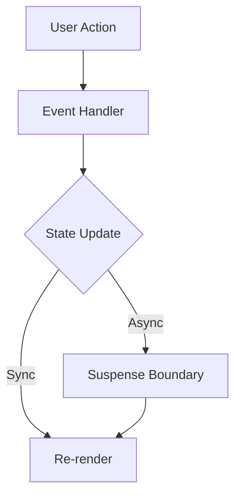

# Medium Article Writer

## What this skill produces

A rich, publication-ready markdown (.md) file for Medium, including:
- YAML frontmatter with SEO metadata (title, subtitle, tags, description)
- The full article body in clean markdown
- Inline Mermaid diagrams for architecture, flows, and system design
- Generated and composed images via nano banana MCP
- Verified facts backed by live web data fetched via Firecrawl
- Links to sources, videos, and prior art discovered during research

---

## Available tools — know what you have

Before starting any article, take stock of which tools are active in the current session. Adapt the workflow based on availability.

| Tool / MCP | What it provides | Primary use in this skill |
|---|---|---|
| `web_search` | Web search results with snippets | Research, current discourse, finding image URLs |
| `web_fetch` | Fetch raw content from a URL | Read full articles, YouTube transcripts, docs |
| **Firecrawl MCP** | Deep scraping, JS-rendered pages, structured extraction | Pulling real data from dashboards, GitHub, npm stats, paywalled-ish pages that `web_fetch` can't render |
| **nano banana MCP** | AI image generation + image editing/compositing | Hero images, concept illustrations, combining two real images into one custom visual |
| **Mermaid** (inline markdown) | Diagram syntax rendered by any Mermaid-capable viewer | Architecture, flows, state machines, component trees |

When a tool is unavailable, fall back gracefully: use `web_fetch` if Firecrawl is down, use image placeholders if nano banana is unavailable.

---

## The process — research first, always

Every article begins with research. Writing without research produces generic content. The skill follows this pipeline in order:

### Phase 1: Research

Before writing a single word, gather real, current information on the topic.

#### 1a. Web search — broad then narrow

Run 3–8 searches depending on topic complexity. Start broad to map the discourse landscape, then narrow to verify specific claims.

```
web_search("react server components production adoption 2025")
web_search("react server components criticism problems")
web_search("site:youtube.com react server components conf talk 2024")
```

Look for:
- Recent blog posts, discussions, conference talks
- Current library/API versions and any breaking changes since your training cutoff
- Counterarguments and real criticisms — the article must engage with actual objections
- Data points, benchmarks, or case studies

#### 1b. Deep-fetch key sources with Firecrawl

Search snippets lie. Fetch the actual pages for the 2–4 most relevant results. Use Firecrawl (`firecrawl_scrape`) over `web_fetch` when:
- The page is JavaScript-rendered (SPAs, dashboards, GitHub Insights, npm trends)
- You need structured data extraction (a table of benchmarks, a changelog)
- `web_fetch` returns partial or garbled content

```
# Firecrawl: get full page content, JS rendered
firecrawl_scrape(url="https://npmtrends.com/zustand-vs-jotai-vs-recoil", formats=["markdown"])

# Firecrawl: search + scrape in one call
firecrawl_search(query="react server components production issues 2025", limit=5)

# Firecrawl: crawl a docs section to verify API behavior
firecrawl_crawl(url="https://nextjs.org/docs/app/building-your-application/rendering/server-components", limit=3)
```

Use `web_fetch` for simpler pages, YouTube transcript URLs, or when Firecrawl isn't available.

#### 1c. YouTube research

Find video content — conference talks, deep dives, community hot takes — because they often contain insights that never made it into a blog post.

```
web_search("youtube react server components Ryan Florence 2024")
```

Then fetch the YouTube URL directly to access the transcript:
```
web_fetch("https://www.youtube.com/watch?v=XXXX")
```

If the user pastes a YouTube URL, always fetch it and learn from the transcript before writing.

#### 1d. Synthesize a research brief

Before proceeding to writing, internally answer:
- What is the current consensus on this topic?
- What's the most interesting tension or gap in the existing discourse?
- What angle adds genuine value vs. repeating what's already out there?
- What specific facts, data points, or quotes should the article reference?

If research shows the user's proposed angle is already well-covered, say so — and suggest a sharper or more original angle based on what you found.

---

### Phase 2: Thesis & Structure

**Clarify the thesis.** Identify the article's core claim. If the user's prompt doesn't contain one, ask: "What's the one thing you want the reader to walk away believing?" Don't start writing without a real thesis.

**Choose the structure.** Pick the article pattern that serves the thesis best. Tell the user which one and why. (See Article Structure section.)

---

### Phase 3: Write

Write the full draft in one pass. Weave in findings from research — specific versions, real data, actual community sentiment. Don't outline first unless the user asks for it.

Generate visuals inline as you write. Every visual should explain something that's harder to explain in text — not decoration.

**Self-edit pass before presenting.** Cut:
- Any sentence that doesn't serve the argument
- Any paragraph where you're warming up instead of saying the thing
- Any hedge that doesn't lead to genuine nuance
- The first paragraph, if the article is stronger starting from the second one

---

### Phase 4: Fact-Check & Verify

This phase is non-negotiable. Publishing wrong data destroys credibility faster than bad writing does.

#### 4a. Extract every verifiable claim

Scan the draft and pull out every factual assertion: library versions, API names, performance numbers, release dates, who-said-what, behavioral descriptions of tools or frameworks.

#### 4b. Re-search to verify each claim category

**Version numbers & API surfaces.**
```
firecrawl_scrape(url="https://github.com/facebook/react/releases", formats=["markdown"])
web_search("react 19 release date official changelog")
```
If the article says "React 19 introduced `use()`", confirm the correct version. Verify exact API signatures, parameter names, return types.

**Performance claims & benchmarks.**
Re-fetch the original benchmark source. Verify numbers match and check the date — a 2023 benchmark may not reflect current performance. If you can't verify a specific number, soften to "in the range of" with a source link.

**Attribution & quotes.**
Search for the original tweet, blog post, RFC, or conference talk. Misattribution is worse than no attribution.

**Behavioral claims about tools/frameworks.**
```
firecrawl_scrape(url="https://nextjs.org/docs/app/...", formats=["markdown"])
```
Framework behavior changes between releases — what was true in Next 13 may not be true in Next 15.

**Community sentiment claims.**
Look for evidence: GitHub stars trends, npm download numbers, survey results, discussion threads.
```
firecrawl_scrape(url="https://npmtrends.com/...", formats=["markdown"])
web_search("state of js 2024 results react usage")
```
If the evidence is thin, rewrite the claim to reflect what you actually found.

**Code examples.**
Re-read every code block. Check for syntax errors, deprecated APIs, incorrect import paths, wrong hook usage. Mentally trace execution — does this code do what the surrounding text claims?

#### 4c. Cross-reference sources

If two sources disagree on a fact, dig deeper. Use official docs or release notes as the tiebreaker. If genuine ambiguity exists, acknowledge it in the article.

#### 4d. Final integrity check

Read the draft one more time asking only: "Is this true?" Not "does this sound good" — "is this true." If you hesitate on any claim, verify it or remove it.

---

### Phase 5: Visuals

Strong technical articles use visuals to compress understanding. Use the right tool for each situation.

#### Mermaid diagrams

Use for: architecture, data flows, component trees, state machines, decision trees, sequence diagrams, dependency graphs.

Embed directly in the markdown:

~~~markdown

~~~

Guidelines:
- Keep diagrams focused — max 10–15 nodes. Split complex systems into multiple diagrams.
- Use meaningful labels, not single letters.
- Choose the right diagram type:
  - `graph TD` / `flowchart LR` — hierarchies and processes
  - `sequenceDiagram` — interactions between components/services
  - `stateDiagram-v2` — state machines
  - `classDiagram` — data models and relationships
  - `gitGraph` — branching strategies

Medium doesn't render Mermaid natively, but the syntax serves as a precise structural description. Always include a brief text summary after the diagram for readers who can't render it.

#### nano banana — image generation

Use nano banana MCP (`generate_image` or the equivalent tool name in the active session) for:
- Hero images and cover art
- Custom concept visualizations that Mermaid can't express
- Abstract visual metaphors that make a technical idea click

**Prompt style for clean technical visuals:**
- "Minimal dark-themed illustration of data flowing through a pipeline, clean geometric shapes, no text"
- "Isometric diagram of a monorepo with interconnected packages, flat design, teal and slate palette"
- "Abstract split-screen comparison: tangled component tree on the left, clean modular tree on the right"

Always write descriptive alt text in the markdown embed:
```markdown

```

#### nano banana — image composition (combining real images)

This is often the most powerful visual workflow. Instead of generating from scratch, find two real images that exist in the world, and use nano banana's edit/compose mode to combine them into a single custom visual.

**The workflow:**

1. **Search for each source image** using `web_search` with specific queries:
```
web_search("claude code logo official image site:anthropic.com")
web_search("itay spector gstack developer portrait")
```

2. **Fetch the image URLs** — identify direct image links from search results (`.png`, `.jpg`, `.webp` URLs).

3. **Compose with nano banana** using its image editing tool (tool name may be `edit_image`, `compose_images`, or similar depending on the MCP version):
```
# Example: combine two images with a prompt describing the desired composition
nano_banana_edit(
  images=["https://example.com/claude-code.png", "https://example.com/gstack-logo.png"],
  prompt="Place both logos side by side on a dark background with a 'meets' arrow between them, clean minimal style"
)
```

4. **Save the output** alongside the article file.

**When to compose vs. generate from scratch:**
- Compose when the article references two real things being compared or combined (tool A vs tool B, person X building thing Y)
- Compose when you need recognizable real-world assets (logos, product screenshots combined with custom illustrations)
- Generate from scratch when the concept is abstract or there are no real images that represent it well

#### Image search (for context images)

Use `web_search` with image-specific queries to find screenshots of tools/UIs being discussed, or photos that ground the article in reality. Always include attribution:
```markdown
 *Screenshot via nextjs.org*
```

#### Placeholder descriptions

For images only the author can capture (personal screenshots, their own terminal output):
```markdown
<!-- IMAGE: Screenshot of your terminal showing the Nx dependency graph. Run `nx graph` and capture the full output. -->
```

#### When to use what

| Situation | Tool |
|---|---|
| Architecture / data flow / component tree | Mermaid diagram |
| Abstract concept / mental model | nano banana (generate) |
| Hero image / cover art | nano banana (generate) |
| Two real things being combined or compared visually | nano banana (compose from real images) |
| Screenshot of a real product / UI | Image search or placeholder |
| Author-specific screenshot needed | Placeholder with instructions |
| Before/after comparison (structural) | Side-by-side Mermaid |
| Before/after comparison (visual) | nano banana (compose) |

**The rule: if you're about to write 3+ paragraphs explaining a structure or flow, stop and ask whether a diagram would do it in one glance.**

---

### Phase 6: Save & Deliver

Save as markdown to `/mnt/user-data/outputs/article-title-slug.md`. Save generated images and SVGs alongside it with matching names (e.g., `article-title-slug-hero.png`, `article-title-slug-rsc-flow.svg`).

Include a brief summary after saving:
- Word count and estimated reading time
- Number of visuals generated
- Any claims that couldn't be fully verified (flagged inline in the draft with `<!-- VERIFY: ... -->` comments)
- Suggested next steps (e.g., "replace the two `<!-- IMAGE: ... -->` placeholders with your own screenshots")

---

## Voice & philosophy

The goal is to write like a senior engineer who has a blog people actually subscribe to. Think Dan Abramov's "Overreacted", Swyx's "swyx.io", Kent C. Dodds — people who write because they figured something out and want to share the insight, not because they need content.

### Core principles

**Take a real position.** Every article needs a thesis — an actual opinion worth defending. Not "X has pros and cons" but "X is the wrong default and here's why." If there isn't a genuine insight, the article shouldn't exist.

**Earn the reader's attention in the first two sentences.** Open with the sharpest version of the insight, a concrete scenario the reader recognizes, or a provocation that's actually backed up by the rest of the piece.

**Show, don't summarize.** Code examples, real terminal output, actual before/after comparisons, diagrams. Abstract claims without proof are filler.

**Write like you talk to a smart colleague.** Direct, first-person, slightly informal. Short sentences when making a point. Longer ones when explaining nuance. Contractions are fine. "I" is fine.

**Ground claims in research.** Cite the benchmark. Link to the discussion. Reference the conference talk. The reader should be able to verify everything.

**Length follows the idea.** A tight insight might be 800 words. A deep architectural comparison might be 2500. Don't pad. Don't truncate. The article is done when the argument is made.

### Anti-patterns — never do these

- **The hollow open.** "In today's fast-paced world of software development..." — just start.
- **Fake contrarianism.** "The framework nobody is talking about" when 50,000 people are talking about it.
- **Hedge soup.** "It's worth noting that..." thrown in reflexively without actually analyzing the tradeoff.
- **The non-opinion opinion.** "Both approaches have merits" as a conclusion.
- **Listicle cosplaying as an article.** "7 Things I Learned About X" where each section is disconnected.
- **Overexplaining the obvious.** Don't define React to a React audience.
- **Sycophantic closers.** "I hope this was helpful!" — the article ends when the argument ends.
- **Unsupported claims.** "React is slow" without a flame chart. "Everyone is switching to X" without evidence.

---

## Article structure

### Pattern 1: The Insight Drop
Best for: sharing a realization, challenging a common practice, presenting a mental model.

```
[Cold open — the situation everyone recognizes]
[The conventional wisdom / what most people do]
[The turn — why that's wrong or incomplete]
[The actual insight, with evidence]
[Implications — what changes if you accept this]
```

### Pattern 2: The Build-Up
Best for: technical walkthroughs, architecture decisions, comparing approaches.

```
[The problem, stated concretely]
[First attempt / obvious solution — and why it falls short]
[The better approach, built incrementally with code]
[The "aha" — what this reveals about the underlying system]
```

### Pattern 3: The War Story
Best for: experience reports, postmortems, lessons from production.

```
[The scene — what happened]
[The investigation / decision-making process]
[What we tried, what failed, what worked]
[The takeaway — what this generalizes to]
```

### Pattern 4: The Opinion Piece
Best for: takes on tooling, industry trends, workflow philosophy.

```
[The claim, stated directly]
[The strongest argument against your position — steelmanned]
[Why you still hold your position, with specific evidence]
[The nuance — where your position has limits]
```

---

## Writing mechanics

### Headings
Medium supports H2 (`##`) and H3 (`###`). Use H2 for major sections. Use H3 sparingly. Don't over-structure — 12 headings makes an article feel like a documentation page.

### Code blocks
Fenced blocks with language hints. Keep examples focused — show the minimum code that proves the point. If a block exceeds ~30 lines, it needs a compelling reason to exist at that length.

```tsx
// What most people write
const UserList = ({ users }) => {
  return users.map(user => <UserCard key={user.id} {...user} />);
};

// What you should write — and here's why
const UserList = ({ users }) => {
  const sortedUsers = useMemo(() =>
    users.toSorted((a, b) => a.name.localeCompare(b.name)),
    [users]
  );
  return sortedUsers.map(user => <UserCard key={user.id} {...user} />);
};
```

### Emphasis
Bold for **key terms being introduced**. Italics for *slight emphasis*. Don't bold entire sentences.

### Links
Link to sources, libraries, prior art, and videos found during research. Each link is a subtle endorsement — use them purposefully.

---

## SEO metadata

Every article starts with a YAML frontmatter block:

```yaml
---
title: "The actual article title — clear, specific, not clickbait"
subtitle: "One sentence that adds context or a secondary hook"
tags:
  - tag-one
  - tag-two
  - tag-three
  - tag-four
  - tag-five
description: "A 1-2 sentence meta description for SEO and social sharing previews."
---
```

### Tag strategy
- 1–2 broad tags with large followings (e.g., "JavaScript", "Programming")
- 1–2 specific tags for the actual topic (e.g., "React Hooks", "Web Performance")
- 1 niche tag if relevant (e.g., "Monorepo", "Audio Programming")

### Title rules
- Be specific. "Rethinking State Management in React" > "My Thoughts on State Management"
- The title should hint at the opinion. "Why I Stopped Using Redux" > "Redux: A Review"
- No "How to X" unless it's genuinely a tutorial
- No numbers unless the structure truly demands it
- No question marks as clickbait

---

## Length calibration

| Type | Typical range | Medium reading time |
|---|---|---|
| Hot take / opinion | 600–1000 words | 3–4 min |
| Technical insight | 1000–1800 words | 5–7 min |
| Deep dive / comparison | 1800–3000 words | 8–12 min |
| Architecture walkthrough | 2500–4000 words | 10–15 min |

---

## Domain-specific guidance

Read the appropriate reference file when the article falls into one of these domains:

- **Frontend / React / Web Dev** → `references/frontend.md`
- **AI / LLM tooling & workflows** → `references/ai-tooling.md`
- **Music production / creative tech** → `references/creative-tech.md`
- **Software architecture & DX** → `references/architecture-dx.md`

These contain domain-specific vocabulary, current discourse context, and strong/weak title examples for each area.
